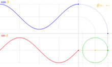

# cre-co.github.io

> A catalog of creative resources, techniques and ideas

[Contribute](https://github.com/cre-co/cre-co.github.io) in GitHub.

## Audio

...

## Graphics

### Trigonometry functions

### Software

**WebGL**

* [headless-gl](https://github.com/stackgl/headless-gl) - windowless WebGL for node.js. Ideal for making artsy bots!
